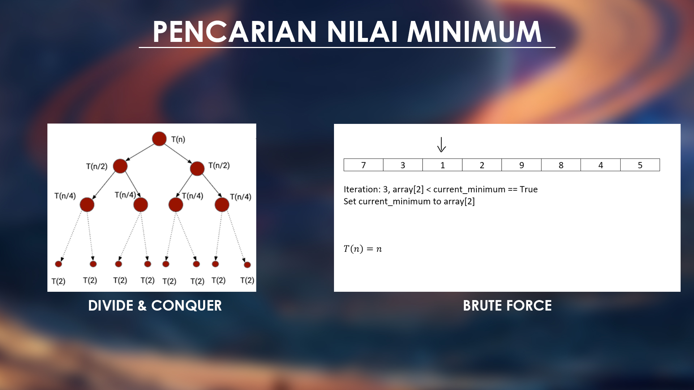
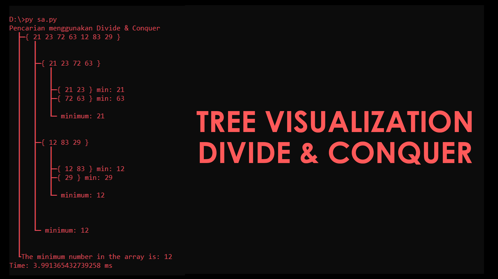
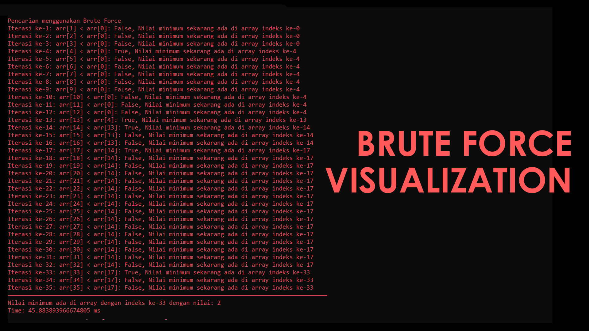
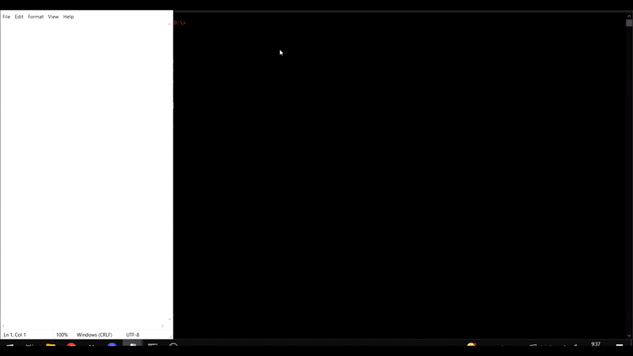

# Pencarian Nilai Minimum

Pencarian nilai minimum adalah proses mencari elemen terkecil atau nilai terendah dalam suatu kumpulan data, seperti array, daftar, atau himpunan. Nilai minimum ini menunjukkan elemen yang memiliki nilai paling rendah di antara semua elemen lainnya.
# Contoh kasus penggunaan pencarian nilai minimum dalam kehidupan sehari-hari dapat meliputi:
1. Mencari harga barang terendah.
2. Mengetahui suhu terendah dalam satu hari.
3. Pencarian waktu perjalanan terpendek dari dua lokasi.
4. Menemukan skor terendah dalam suatu ujian.
5. Dan masih banyak kasus lainnya.

# Pendekatan Strategi Divide & Conquer

Divide and Conquer adalah pendekatan yang memecah masalah menjadi submasalah yang lebih kecil, menyelesaikan setiap submasalah secara terpisah, dan kemudian menggabungkan solusi submasalah menjadi solusi akhir. Dalam konteks pencarian nilai minimum, strategi ini akan memecah array menjadi setengah dari array aslinya dan dilakukan berulang secara rekursif hingga panjang array menjadi kecil (misalnya menjadi 2), kemudian dilakukan perbandingan untuk mencari nilai minimumnya.

# Pendekatan Strategi Brute Force

Brute Force adalah pendekatan sederhana yang mencoba semua kemungkinan solusi untuk memecahkan masalah. Dalam konteks pencarian nilai minimum, strategi Brute Force akan mencoba semua pasangan angka dalam array dan mengambil nilai minimum di antara mereka.

# Pembacaan input melalui file teks

Kode program ini dapat membaca input berupa file teks sehingga hal ini memudahkan bagi para pengguna apabila memiliki ukuran array yang cukup besar.
